> **РОССИЙСКИЙ** **УНИВЕРСИТЕТ** **ДРУЖБЫ** **НАРОДОВ** **Факультет**
> **физико-математических** **и** **естественных** **наук**
>
> **Кафедра** **прикладной** **информатики** **и** **теории**
> **вероятностей**
>
> **ОТЧЕТ**
>
> **ПО** **ЛАБОРАТОРНОЙ** **РАБОТЕ** **№** **<u>2</u>**
>
> *<u>дисциплина: Архитектура компьютера</u>*
>
> <u>Студент: Чайкин Кирилл Владимирович</u>
>
> Группа: НММ бд-03-24
>
> **МОСКВА** **2024** **г.**

**Содержание**

**1** **Цель** **работы** **5** **2** **Задание** **6** **3**
**Теоретическое** **введение** **8** **4** **Выполнение**
**лабораторной** **работы** **13** **5** **Выводы** **16** **Список**
**литературы** **29**

**1** **Цель** **работы**

Целью работы является изучить идеологию и применение средств контроля
версий. Приобрести практические навыки по работе с системой git.

> 3

**2** **Задание**

> 1\. Техническое обеспечение
>
> 2\. Регисатрация на GitHub
>
> 3\. Локальная настройка Git
>
> 4\. Создание SSH-ключа для авторизации на GitHub
>
> 5\. Создание копии репозитория на основе уже существующего репозитория
>
> 6\. Настройка каталога курса
>
> 7\. Задание для самостоятельной работы

**3** **Теоретическое** **введение**

3.1 Системы контроля версий. Общие понятия

Системы контроля версий (Version Control System, VCS) применяются при
работе нескольких человек над одним проектом. Обычно основное дерево
проекта хранится в локальном или удалённом репозитории, к которому
настроен доступ для участников проекта. При внесении изменений в
содержание проекта система контроля версий позволяет их фиксировать,
совмещать изменения, произведённые разными участниками проекта,
производить откат к любой более ранней версии проекта, если это
требуется.

В классических системах контроля версий используется централизованная
модель, предполагающая наличие единого репозитория для хранения файлов.
Выполнение большинства функций по управлению версиями осуществляется
специальным сервером. Участник проекта (пользователь) перед началом
работы посредством определённых команд получает нужную ему версию
файлов. После внесения изменений, пользователь размещает новую версию в
хранилище. При этом предыдущие версии не удаляются из центрального
хранилища и к ним можно вернуться в любой момент. Сервер может сохранять
не полную версию изменённых файлов, а производить так называемую
дельта-компрессию — сохранять только изменения между последовательными
версиями, что позволяет уменьшить объём хранимых данных.

Системы контроля версий поддерживают возможность отслеживания и
разрешения конфликтов, которые могут возникнуть при работе нескольких
человек над одним файлом. Можно объединить (слить) изменения, сделанные
разными участниками (автоматически или вручную), вручную выбрать нужную
версию, отменить изменения вовсе или заблокировать файлы для изменения.
В зависимости от настроек блокировка не позволяет другим пользователям
получить рабочую копию или препятствует изменению рабочей копии файла
средствами файловой системы ОС, обеспечивая таким образом,
привилегированный доступ только одному пользователю, работающему с
файлом.

> Системы контроля версий также могут обеспечивать дополнительные, более
>
> 5

гибкие функциональные возможности. Например, они могут поддерживать
работу с несколькими версиями одного файла, сохраняя общую историю
изменений до точки ветвления версий и собственные истории изменений
каждой ветви. Кроме того, обычно доступна информация о том, кто из
участников, когда и какие изменения вносил. Обычно такого рода
информация хранится в журнале изменений, доступ к которому можно
ограничить.

В отличие от классических, в распределённых системах контроля версий
центральный репозиторий не является обязательным.

Среди классических VCS наиболее известны CVS, Subversion, а среди
распределённых — Git, Bazaar, Mercurial. Принципы их работы схожи,
отличаются они в основном синтаксисом используемых в работе команд.

3.2. Система контроля версий Git

Система контроля версий Git представляет собой набор программ командной
строки. Доступ к ним можно получить из терминала посредством ввода
команды git с различными опциями.

Благодаря тому, что Git является распределённой системой контроля
версий, резервную копию локального хранилища можно сделать простым
копированием или архивацией.

3.3. Основные команды git

Наиболее часто используемые команды git представлены в таблице 2.1

Команда git init

git pull

git push

git status git diff git add

git add имена_файлов

Описание

создание основного дерева репозитория

получение обновлений (изменений) текущего дерева из центрального
репозитория

отправка всех произведённых изменений локального дерева в центральный
репозиторий

просмотр списка изменённых файлов в текущей директории просмотр текущих
изменения

добавить все изменённые и/или созданные файлы и/или каталоги

добавить конкретные изменённые и/или созданные файлы и/или каталоги

git rm имена_файловудалить файл и/или каталог из индекса репозитория
(при этом файл и/или каталог остаётся в локальной директории)

git commit -am сохранить все добавленные изменения и все изменённые
файлы 'Описание коммита'

git checkout -b имя_ветки

git checkout имя_ветки

git push origin имя_ветки

git merge --no-ff имя_ветки

git branch -d имя_ветки

git branch -D имя_ветки

git push origin :имя_ветки

создание новой ветки, базирующейся на текущей

переключение на некоторую ветку (при переключении на ветку, которой ещё
нет в локальном репозитории, она будет создана и связана с удалённой)

отправка изменений конкретной ветки в центральный репозиторий

слияние ветки с текущим деревом

удаление локальной уже слитой с основным деревом ветки

принудительное удаление локальной ветки

удаление ветки с центрального репозитория

3.4. Стандартные процедуры работы при наличии центрального

репозитория

> Работа пользователя со своей веткой начинается с проверки и получения

изменений из центрального репозитория (при этом в локальное дерево до
начала этой процедуры не должно было вноситься изменений):

git checkout master

git pull

git checkout -b имя_ветки

> Затем можно вносить изменения в локальном дереве и/или ветке.

После завершения внесения какого-то изменения в файлы и/или каталоги
проекта необходимо разместить их в центральном репозитории. Для этого
необходимо проверить, какие файлы изменились к текущему моменту:

git status

> 7

и при необходимости удаляем лишние файлы, которые не хотим отправлять в
центральный репозиторий.

> Затем полезно просмотреть текст изменений на предмет соответствия
> правилам

ведения чистых коммитов:

git diff

Если какие-либо файлы не должны попасть в коммит, то помечаем только те
файлы, изменения которых нужно сохранить. Для этого используем команды
добавления и/или удаления с нужными опциями:

git add имена_файлов

git rm имена_файлов

> Если нужно сохранить все изменения в текущем каталоге, то используем:

git add .

> Затем сохраняем изменения, поясняя, что было сделано:

git commit -am "Some commit message"

> и отправляем в центральный репозиторий:

git push origin имя_ветки

> или

git push

2.3. Техническое обеспечение

Лабораторная работа подразумевает выполнение настройки и работы с
системой контроля версий Git (https://git-scm.com/). Выполнение работы
возможно как в дисплейном классе факультета физико-математических и
естественных наук РУДН, так и дома. Описание выполнения работы приведено
для дисплейного класса со следующими характеристиками техники: – Intel
Core i3-550 3.2 GHz, 4 GB оперативной памяти, 8 GB свободного места на
жёстком диске; – ОС Linux Gentoo (http://www.gentoo.ru/).

**4** **Выполнение** **лабораторной**
**работы**

**4.1.** **Настройка** **github**

> Создал учетную запись на github (рис 1.1)
>
> *рисунок* *1.1* *:* *учетная* *запись* *github*

**4.2.** **Базовая** **настройка** **git**

Cделал предварительную конфигурацию git. Настроил utf-8 в выводе
сообщений, задал имя начальной ветки и использовал параметры autocrlf и
safecrlf. (рис 1.2)

> 9

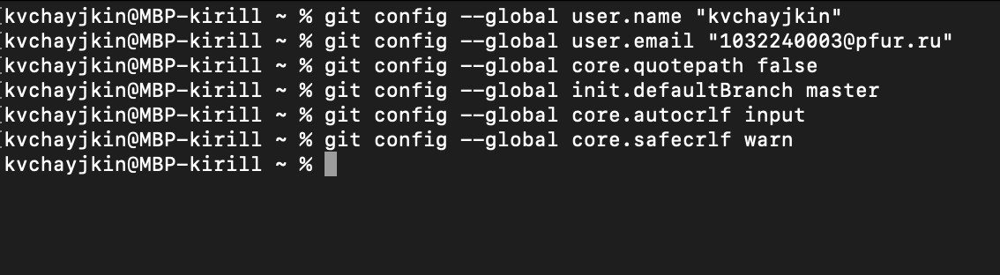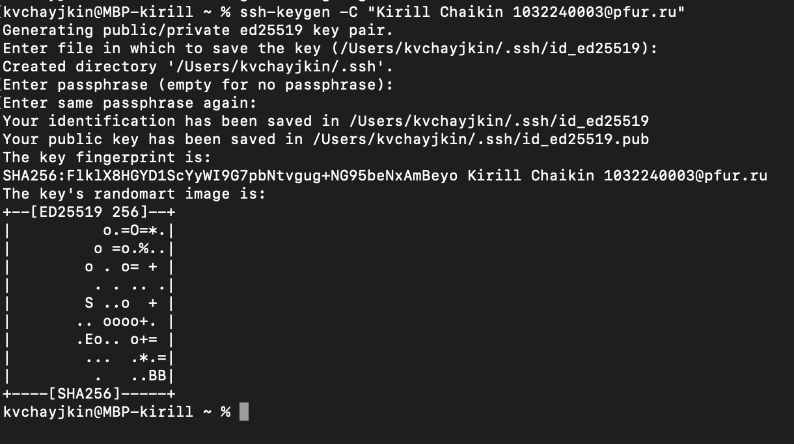

> *рис1.2:* *предварительная* *конфигурация* *git*

**4.3.** **Создание** **SSH** **ключа**

Создал ключ который хранится в каталоге ssh (рис 1.6)

*рисунок* *1.6:* *создание* *ключа* *который* *хранится* *в* *каталоге*
*ssh*

Добавил SSH key на github (рис 1.7), команда cat ~/.ssh/id_rsa.pub
выдает ключ

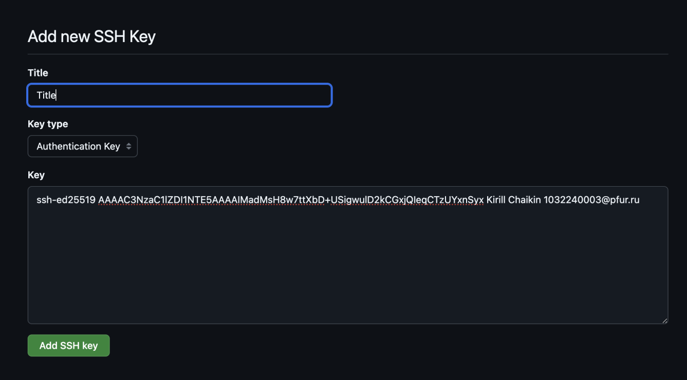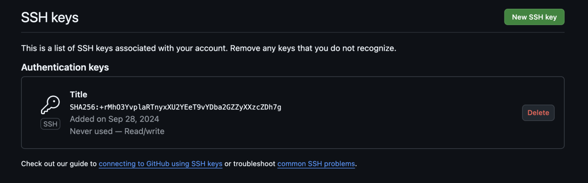

*рис1.7:* *добавление* *SSH* *ключа* *на* *GitHub*

**4.4.** **Сознание** **рабочего** **пространства** **и**
**репозитория** **курса** **на**

**основе** **шаблона**

Создал директорию для предмета Архитектруа Компьютера (рис 1.8)

> 11

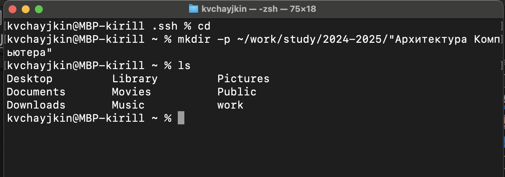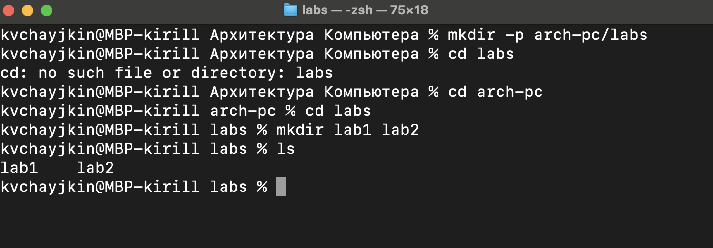

> *рис* *1.8:* *создание* *директории* *для* *предмета* *Архитектура*
> *Компьютера*

Также создал директории для лабораторных работ (рис 1.9)

*рис* *1.10:* *Создание* *директория* *для* *Лабораторных* *работ*

**4.5.** **Сознание** **репозитория** **курса** **на** **основе**
**шаблона**

Клонировал репозиторий (рис 1.11)

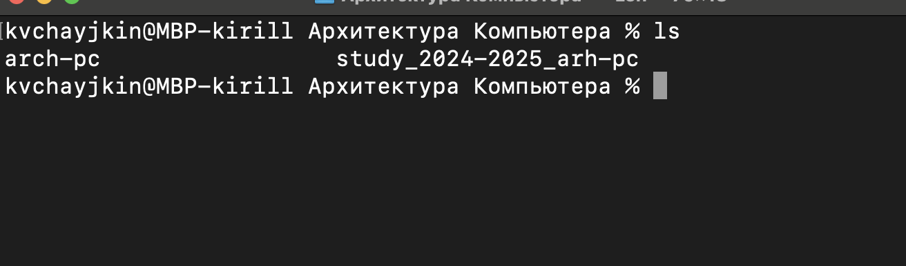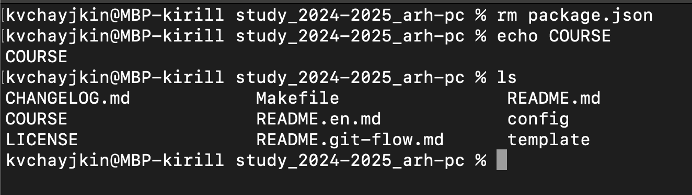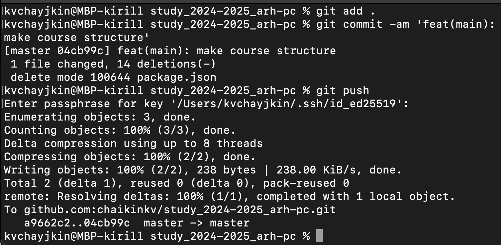

Удаление и создание новых файлов (рис 1.12)

**4.7** **Задание** **для** **самостоятельной** **работы**

> 13

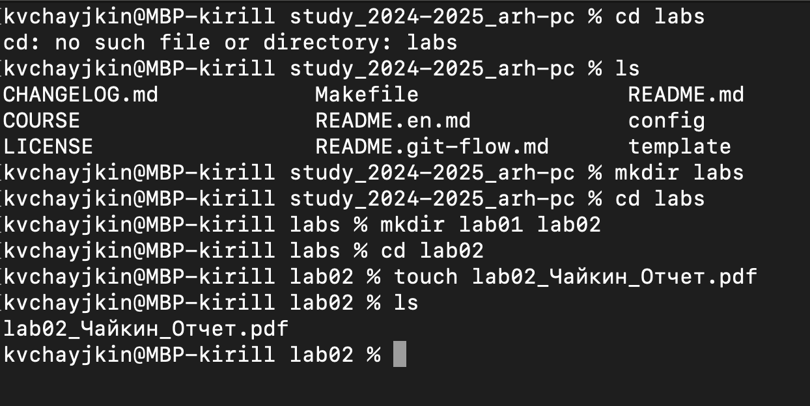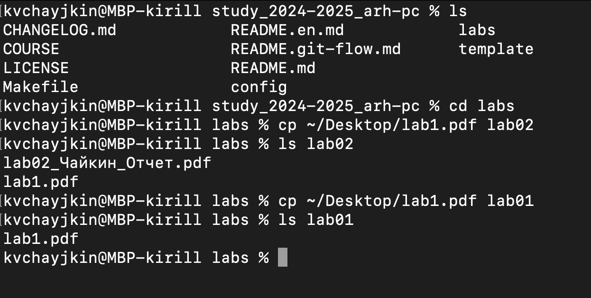

*рис* *1.15:* *Копирование* *второго* *отчета*

Создал отчет Лаабораторной работы 2 (рис 1.15)

Загрузил отчет первой лабораторной работы (рис 1.16)

> *1.17:* *Загрузка* *в* *первого* *отчета*

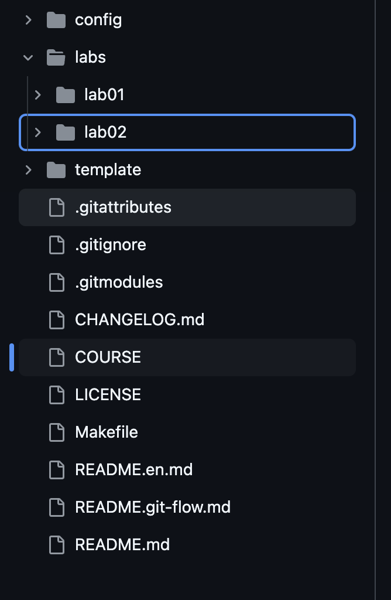Загрузил все на сервер

(рис1.18)

> *1.18*
>
> 15

**5** **Выводы**

Научился загружать файлы и выгружать файлы с git

**Список** **литературы**

1

.

А

р х и т е к у т р а

Э

> 17
